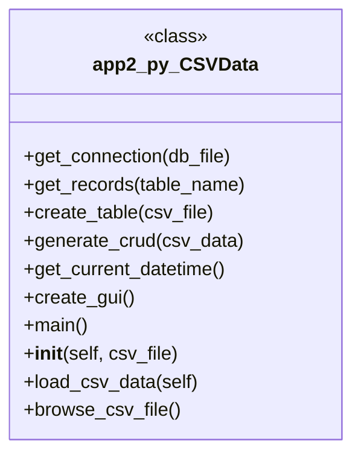

# Polyglot Codebase Knowledge Graph

> Generated offline by **readmenator**. 2 files, 25 symbols, 12 imports. Supports C, C++, Python, Go, Rust, JS/TS, Java, C#, Shell, PHP, Dart, GDScript, Nim, ASM, Ruby, Swift, Kotlin, Scala, Lua, Elixir.
> No LLMs. No tokens. Pure static analysis. See more [here](https://github.com/grisuno/ReadMenator)

**Start here:** Statistics Dashboard for scope, God Nodes for blast radius, Architecture Reference for per-file API. Agents: prefer `readmenator-agent/INDEX.md` + `SYMBOLS.md`.

**Wiki:** prefer `readmenator-wiki/index.md` for progressive disclosure: one synthesis page per community, `connections.json` with EXTRACTED vs INFERRED confidence, `queries.md` log, `REPORT.md` audit.

**Confidence:** EXTRACTED = parsed from source, INFERRED = heuristic bridge, AMBIGUOUS = reported, never hidden. See `readmenator-wiki/REPORT.md`.

**Total Files Parsed:** 2 | **Total Symbols Extracted:** 25 | **Total Imports:** 12

<!-- ranking_model: v1.0 | weights: {ppr:0.45,auth:0.2,test:0.15,doc:0.1,fresh:0.1} | alpha:0.85 | commit:1e0fd0b | date:2026-07-18 -->


## Table of Contents

1. [Statistics Dashboard](#statistics-dashboard)
2. [Architectural Layers](#architectural-layers)
3. [Ranked Context](#ranked-context)
4. [God Nodes](#god-nodes)
5. [Suggested Questions](#suggested-questions)
6. [Hotspot Analysis](#hotspot-analysis)
7. [Change Impact Analysis](#change-impact-analysis)
8. [Suggested Linting Rules](#suggested-linting-rules)
9. [Concept Graph](#concept-graph)
10. [Orphans](#orphans)
11. [Query Recipes](#query-recipes)
12. [Structural Knowledge Map](#structural-knowledge-map)
13. [UML Class Diagram](#uml-class-diagram)
14. [Code Property Graph](#code-property-graph)
15. [Architecture Reference](#architecture-reference)
    - [PY (2 files)](#py-2-files)

---

## Statistics Dashboard

| Metric | Value |
|--------|-------|
| Total Files | 2 |
| Total Symbols | 25 |
| Total Imports | 12 |
| Call Edges | 324 |
| Inheritance Edges | 0 |
| Languages | 1 |
| Avg Symbols/File | 12.5 |
| Avg Imports/File | 6.0 |

### Top Files by Import Count (Fan-Out)

| File | Imports | Symbols | Language |
|------|---------|---------|----------|
| `app.py` | 6 | 14 | py |
| `app2.py` | 6 | 11 | py |

---

## Architectural Layers

Auto-detected from path patterns, naming conventions, and imported frameworks.

| Layer | Files |
|-------|-------|
| utility | 2 |

### utility

- `app.py` (py, 14 symbols)
- `app2.py` (py, 11 symbols)

---

## Ranked Context

Files ranked by composite score for the current query context. The ranking combines Personalized PageRank (query relevance), global authority, test coverage, documentation coverage, and code freshness. Model: v1.0.

| Rank | File | Composite | PPR | Authority | Test | Doc |
|------|------|-----------|-----|-----------|------|-----|
| 1 | `app.py` | 0.0000 | 0.0000 | 0.0000 | 0.00 | 0.00 |
| 2 | `app2.py` | 0.0000 | 0.0000 | 0.0000 | 0.00 | 0.00 |

---

## God Nodes

Most architecturally central files ranked by combined import/export degree and symbol richness.

| File | Score | Connections | PageRank |
|------|-------|-------------|----------|
| `app.py` | 1.4 | | 0.0000 |
| `app2.py` | 1.1 | | 0.0000 |

---

## Suggested Questions

Auto-generated exploration prompts based on graph structure:

- What does app.py depend on, and what depends on it? (0 connections)
- What does app2.py depend on, and what depends on it? (0 connections)
- What is CSVData in app2.py and how is it used?
- What is the overall architecture of this codebase?

---

## Hotspot Analysis

Files ranked by combined complexity (symbol count) and centrality (connection count). High-scoring files are architecturally critical and may need refactoring attention.

| File | Complexity | Centrality | Combined | Symbols | Connections |
|------|-----------|------------|----------|---------|-------------|
| `app.py` | 1.000 | 1.000 | 1.000 | 14 | 6 |
| `app2.py` | 0.786 | 1.000 | 0.914 | 11 | 6 |

---

## Concept Graph

Semantic second-brain layer: nouns are concept nodes, verbs are edges. Each noun maps atomically to a file set (EXTRACTED); each verb aggregates structural imports, calls, and inherits into consumes, invokes, extends, depends_on, or bridges (INFERRED).

**11 concepts, 0 relations.**

| Concept | Files | Mentions |
|---------|-------|----------|
| `create` | 2 | 6 |
| `get` | 2 | 6 |
| `csv` | 2 | 3 |
| `browse` | 2 | 2 |
| `connection` | 2 | 2 |
| `crud` | 2 | 2 |
| `file` | 2 | 2 |
| `generate` | 2 | 2 |
| `gui` | 2 | 2 |
| `records` | 2 | 2 |
| `table` | 2 | 2 |

### Dialectic Prompts

- Thesis: `browse` centralizes 2 files; Antithesis: `connection` pulls 2 files with 2 shared (Jaccard 1.00); Synthesis: should they merge, split by layer, or keep `bridges` explicit?
- Thesis: `browse` centralizes 2 files; Antithesis: `create` pulls 2 files with 2 shared (Jaccard 1.00); Synthesis: should they merge, split by layer, or keep `bridges` explicit?
- Thesis: `browse` centralizes 2 files; Antithesis: `crud` pulls 2 files with 2 shared (Jaccard 1.00); Synthesis: should they merge, split by layer, or keep `bridges` explicit?
- Thesis: `browse` centralizes 2 files; Antithesis: `csv` pulls 2 files with 2 shared (Jaccard 1.00); Synthesis: should they merge, split by layer, or keep `bridges` explicit?
- Thesis: `browse` centralizes 2 files; Antithesis: `file` pulls 2 files with 2 shared (Jaccard 1.00); Synthesis: should they merge, split by layer, or keep `bridges` explicit?
- Thesis: `browse` centralizes 2 files; Antithesis: `generate` pulls 2 files with 2 shared (Jaccard 1.00); Synthesis: should they merge, split by layer, or keep `bridges` explicit?
- Thesis: `browse` centralizes 2 files; Antithesis: `get` pulls 2 files with 2 shared (Jaccard 1.00); Synthesis: should they merge, split by layer, or keep `bridges` explicit?
- Thesis: `browse` centralizes 2 files; Antithesis: `gui` pulls 2 files with 2 shared (Jaccard 1.00); Synthesis: should they merge, split by layer, or keep `bridges` explicit?
- Thesis: `browse` centralizes 2 files; Antithesis: `records` pulls 2 files with 2 shared (Jaccard 1.00); Synthesis: should they merge, split by layer, or keep `bridges` explicit?
- Thesis: `browse` centralizes 2 files; Antithesis: `table` pulls 2 files with 2 shared (Jaccard 1.00); Synthesis: should they merge, split by layer, or keep `bridges` explicit?

---

## Change Impact Analysis

Files sorted by how many other files would be affected if they changed. High-impact files should be changed with caution.

| File | Direct Dependents | Transitive Dependents | Total Impact |
|------|------------------|----------------------|--------------|
| `app.py` | 0 | 0 | 0 |
| `app2.py` | 0 | 0 | 0 |

---

## Suggested Linting Rules

Automatically suggested linting and security rules based on patterns detected in the codebase. These can be exported as Semgrep rules using the `--export-rules` flag.

| Rule ID | Severity | Description | Language | Matches |
|---------|----------|-------------|----------|---------|
| `RM001` | info | Large number of functions in py: 24 total | py | 24 |
| `RM002` | info | Print statement found (consider logging instead) | python | 3 |

---

## Orphans

Files with no documentation or low connectivity. These are candidates for documentation investment or cleanup.

- `app.py` (14 symbols, no doc)
- `app2.py` (11 symbols, no doc)

---

## Query Recipes

Example queries you can run against this knowledge base using the ranking engine:

```
# Find files most relevant to a concept
readmenator query "Where is the import resolver implemented?"

# Rank files by relevance to a topic
readmenator query "How does documentation generation work?"

# Explain why a file ranks highly
readmenator query "explain readmenator/_documentation.py"

# Trace dependency paths with ranked context
readmenator query "path from CLI to exporter"
```

The ranking model uses the following signals:

- **Personalized PageRank** (45% weight): query-specific relevance via seed propagation
- **Global Authority** (20% weight): structural importance via standard PageRank
- **Test Coverage** (15% weight): fraction of symbols referenced in test files
- **Doc Coverage** (10% weight): presence of docstrings and file-level docs
- **Freshness** (10% weight): recent modification activity

Results include score decomposition and justification paths for each ranked item.

---

## Structural Knowledge Map

```mermaid
graph TD
    classDef mod fill:#1e1e1e,stroke:#ff6666,stroke-width:2px,color:#fff;
    classDef cls fill:#2d2d2d,stroke:#4ec9b0,stroke-width:2px,color:#fff;
    classDef fn fill:#333,stroke:#dcdcaa,stroke-width:1px,color:#dcdcaa;
    classDef ext fill:#111,stroke:#666,stroke-dasharray:5 5,color:#aaa;
    app_py["app.py (py)"]
    class app_py mod;
    app_py_get_connection["get_connection"]
    class app_py_get_connection fn;
    app_py --> app_py_get_connection
    app_py_get_records["get_records"]
    class app_py_get_records fn;
    app_py --> app_py_get_records
    app_py_get_record_by_id["get_record_by_id"]
    class app_py_get_record_by_id fn;
    app_py --> app_py_get_record_by_id
    app_py_insert_record["insert_record"]
    class app_py_insert_record fn;
    app_py --> app_py_insert_record
    app_py_update_record["update_record"]
    class app_py_update_record fn;
    app_py --> app_py_update_record
    app2_py["app2.py (py)"]
    class app2_py mod;
    ext_tkinter["tkinter"]
    class ext_tkinter ext;
    app_py -.->|imports| ext_tkinter
    app_py -.->|imports| ext_tkinter
    ext_sqlite3["sqlite3"]
    class ext_sqlite3 ext;
    app_py -.->|imports| ext_sqlite3
    ext_csv["csv"]
    class ext_csv ext;
    app_py -.->|imports| ext_csv
    ext_os["os"]
    class ext_os ext;
    app_py -.->|imports| ext_os
    ext_datetime["datetime"]
    class ext_datetime ext;
    app_py -.->|imports| ext_datetime
    app2_py -.->|imports| ext_tkinter
    app2_py -.->|imports| ext_tkinter
    app2_py -.->|imports| ext_sqlite3
    app2_py -.->|imports| ext_csv
    app2_py -.->|imports| ext_os
    app2_py -.->|imports| ext_datetime
```



---

## UML Class Diagram

Auto-generated Mermaid class diagram from parsed class-level symbols. Shows classes, structs, interfaces, traits, and their methods with inheritance and dependency relationships.



---

## Code Property Graph

Machine-readable Code Property Graph (CPG) in JSON-LD format. This block allows AI agents to parse the full structural graph without additional file reads. Compatible with GraphRAG pipelines.

```json
{"@context": "https://schema.org", "analysis": {"communities": [], "god_nodes": [{"node_id": "app.py", "score": 1.4}, {"node_id": "app2.py", "score": 1.1}], "surprising_connections": []}, "edges": [{"confidence": "EXTRACTED", "relation": "imports", "source": "app.py", "target": "tkinter"}, {"confidence": "EXTRACTED", "relation": "imports", "source": "app.py", "target": "tkinter"}, {"confidence": "EXTRACTED", "relation": "imports", "source": "app.py", "target": "sqlite3"}, {"confidence": "EXTRACTED", "relation": "imports", "source": "app.py", "target": "csv"}, {"confidence": "EXTRACTED", "relation": "imports", "source": "app.py", "target": "os"}, {"confidence": "EXTRACTED", "relation": "imports", "source": "app.py", "target": "datetime"}, {"confidence": "EXTRACTED", "relation": "imports", "source": "app2.py", "target": "tkinter"}, {"confidence": "EXTRACTED", "relation": "imports", "source": "app2.py", "target": "tkinter"}, {"confidence": "EXTRACTED", "relation": "imports", "source": "app2.py", "target": "sqlite3"}, {"confidence": "EXTRACTED", "relation": "imports", "source": "app2.py", "target": "csv"}, {"confidence": "EXTRACTED", "relation": "imports", "source": "app2.py", "target": "os"}, {"confidence": "EXTRACTED", "relation": "imports", "source": "app2.py", "target": "datetime"}], "generator": "readmenator", "metadata": {"edge_count": 336, "file_count": 2, "language_count": 1, "symbol_count": 25}, "nodes": [{"id": "app.py", "kind": "module", "label": "app.py", "language": "py", "sha256": "0084ec600e4d90b9", "symbol_count": 14, "symbols": [{"kind": "function", "line": 9, "name": "get_connection", "signature": "def get_connection(db_file)"}, {"kind": "function", "line": 15, "name": "get_records", "signature": "def get_records(table_name)"}, {"kind": "function", "line": 24, "name": "get_record_by_id", "signature": "def get_record_by_id(table_name, id)"}, {"kind": "function", "line": 33, "name": "insert_record", "signature": "def insert_record(table_name, data)"}, {"kind": "function", "line": 44, "name": "update_record", "signature": "def update_record(table_name, id, data)"}, {"kind": "function", "line": 55, "name": "delete_record", "signature": "def delete_record(table_name, id)"}, {"kind": "function", "line": 63, "name": "create_table", "signature": "def create_table(csv_file)"}, {"kind": "function", "line": 98, "name": "generate_crud", "signature": "def generate_crud()"}, {"kind": "function", "line": 184, "name": "create_gui", "signature": "def create_gui()"}, {"kind": "function", "line": 221, "name": "create_label", "signature": "def create_label(root, text)"}, {"kind": "function", "line": 225, "name": "create_button", "signature": "def create_button(root, text, command)"}, {"kind": "function", "line": 229, "name": "button_click", "signature": "def button_click()"}, {"kind": "function", "line": 232, "name": "main", "signature": "def main()"}, {"kind": "function", "line": 195, "name": "browse_csv_file", "signature": "def browse_csv_file()"}]}, {"id": "app2.py", "kind": "module", "label": "app2.py", "language": "py", "sha256": "d80b23b9a239e8e7", "symbol_count": 11, "symbols": [{"kind": "function", "line": 9, "name": "get_connection", "signature": "def get_connection(db_file)"}, {"kind": "function", "line": 14, "name": "get_records", "signature": "def get_records(table_name)"}, {"kind": "function", "line": 22, "name": "create_table", "signature": "def create_table(csv_file)"}, {"kind": "function", "line": 46, "name": "generate_crud", "signature": "def generate_crud(csv_data)"}, {"kind": "class", "line": 127, "name": "CSVData", "signature": "class CSVData"}, {"kind": "method", "line": 137, "name": "get_current_datetime", "signature": "def get_current_datetime()"}, {"kind": "method", "line": 140, "name": "create_gui", "signature": "def create_gui()"}, {"kind": "method", "line": 167, "name": "main", "signature": "def main()"}, {"kind": "method", "line": 128, "name": "__init__", "signature": "def __init__(self, csv_file)"}, {"kind": "method", "line": 132, "name": "load_csv_data", "signature": "def load_csv_data(self)"}, {"kind": "method", "line": 148, "name": "browse_csv_file", "signature": "def browse_csv_file()"}]}], "type": "CodePropertyGraph", "version": "1.0"}
```

---

## Architecture Reference

### PY (2 files)

#### `app.py`
**Path:** `app.py`

**Functions:**
- `get_connection` (line 9) `def get_connection(db_file)`
- `get_records` (line 15) `def get_records(table_name)`
- `get_record_by_id` (line 24) `def get_record_by_id(table_name, id)`
- `insert_record` (line 33) `def insert_record(table_name, data)`
- `update_record` (line 44) `def update_record(table_name, id, data)`
- `delete_record` (line 55) `def delete_record(table_name, id)`
- `create_table` (line 63) `def create_table(csv_file)`
- `generate_crud` (line 98) `def generate_crud()`
- `create_gui` (line 184) `def create_gui()`
- `create_label` (line 221) `def create_label(root, text)`
- `create_button` (line 225) `def create_button(root, text, command)`
- `button_click` (line 229) `def button_click()`
- `main` (line 232) `def main()`
- `browse_csv_file` (line 195) `def browse_csv_file()`

#### `app2.py`
**Path:** `app2.py`

**Classes:**
- `CSVData` (line 127) `class CSVData`

**Functions:**
- `get_connection` (line 9) `def get_connection(db_file)`
- `get_records` (line 14) `def get_records(table_name)`
- `create_table` (line 22) `def create_table(csv_file)`
- `generate_crud` (line 46) `def generate_crud(csv_data)`

**Methods:**
- `get_current_datetime` (line 137) `def get_current_datetime()`
- `create_gui` (line 140) `def create_gui()`
- `main` (line 167) `def main()`
- `__init__` (line 128) `def __init__(self, csv_file)`
- `load_csv_data` (line 132) `def load_csv_data(self)`
- `browse_csv_file` (line 148) `def browse_csv_file()`
