# Polyglot Codebase Knowledge Graph

> Generated offline by **readmenator**. Supports C, C++, Python, Go, Rust, JS/TS, Java, C#, Shell, PHP, Dart, GDScript, Nim, ASM.
> No LLMs. No tokens. Pure static analysis. See more [here](https://github.com/grisuno/ReadMenator)

**Total Files Parsed:** 2 | **Total Symbols Extracted:** 25 | **Total Imports:** 12

## Structural Knowledge Map

```mermaid
graph TD
    classDef mod fill:#1e1e1e,stroke:#ff6666,stroke-width:2px,color:#fff;
    classDef cls fill:#2d2d2d,stroke:#4ec9b0,stroke-width:2px,color:#fff;
    classDef fn fill:#333,stroke:#dcdcaa,stroke-width:1px,color:#dcdcaa;
    classDef ext fill:#111,stroke:#666,stroke-dasharray:5 5,color:#aaa;
    app_py["app.py (py)"]
    class app_py mod;
    app_py_get_connection["get_connection"]
    class app_py_get_connection fn;
    app_py --> app_py_get_connection
    app_py_get_records["get_records"]
    class app_py_get_records fn;
    app_py --> app_py_get_records
    app_py_get_record_by_id["get_record_by_id"]
    class app_py_get_record_by_id fn;
    app_py --> app_py_get_record_by_id
    app_py_insert_record["insert_record"]
    class app_py_insert_record fn;
    app_py --> app_py_insert_record
    app_py_update_record["update_record"]
    class app_py_update_record fn;
    app_py --> app_py_update_record
    app2_py["app2.py (py)"]
    class app2_py mod;
    app2_py_get_connection["get_connection"]
    class app2_py_get_connection fn;
    app2_py --> app2_py_get_connection
    app2_py_get_records["get_records"]
    class app2_py_get_records fn;
    app2_py --> app2_py_get_records
    app2_py_create_table["create_table"]
    class app2_py_create_table fn;
    app2_py --> app2_py_create_table
    app2_py_generate_crud["generate_crud"]
    class app2_py_generate_crud fn;
    app2_py --> app2_py_generate_crud
    app2_py_CSVData["CSVData"]
    class app2_py_CSVData cls;
    app2_py --> app2_py_CSVData
    ext_tkinter["tkinter"]
    class ext_tkinter ext;
    app_py -.->|imports| ext_tkinter
    app_py -.->|imports| ext_tkinter
    ext_sqlite3["sqlite3"]
    class ext_sqlite3 ext;
    app_py -.->|imports| ext_sqlite3
    ext_csv["csv"]
    class ext_csv ext;
    app_py -.->|imports| ext_csv
    ext_os["os"]
    class ext_os ext;
    app_py -.->|imports| ext_os
    ext_datetime["datetime"]
    class ext_datetime ext;
    app_py -.->|imports| ext_datetime
    app2_py -.->|imports| ext_tkinter
    app2_py -.->|imports| ext_tkinter
    app2_py -.->|imports| ext_sqlite3
    app2_py -.->|imports| ext_csv
    app2_py -.->|imports| ext_os
    app2_py -.->|imports| ext_datetime
```

---

## Architecture Reference

### PY (2 files)

#### `app.py`
**Path:** `app.py`

**Functions:**
- `get_connection` (line 9) `def get_connection(db_file)`
- `get_records` (line 15) `def get_records(table_name)`
- `get_record_by_id` (line 24) `def get_record_by_id(table_name, id)`
- `insert_record` (line 33) `def insert_record(table_name, data)`
- `update_record` (line 44) `def update_record(table_name, id, data)`
- `delete_record` (line 55) `def delete_record(table_name, id)`
- `create_table` (line 63) `def create_table(csv_file)`
- `generate_crud` (line 98) `def generate_crud()`
- `create_gui` (line 184) `def create_gui()`
- `create_label` (line 221) `def create_label(root, text)`
- `create_button` (line 225) `def create_button(root, text, command)`
- `button_click` (line 229) `def button_click()`
- `main` (line 232) `def main()`
- `browse_csv_file` (line 195) `def browse_csv_file()`

#### `app2.py`
**Path:** `app2.py`

**Classes:**
- `CSVData` (line 127) `class CSVData`

**Functions:**
- `get_connection` (line 9) `def get_connection(db_file)`
- `get_records` (line 14) `def get_records(table_name)`
- `create_table` (line 22) `def create_table(csv_file)`
- `generate_crud` (line 46) `def generate_crud(csv_data)`
- `get_current_datetime` (line 137) `def get_current_datetime()`
- `create_gui` (line 140) `def create_gui()`
- `main` (line 167) `def main()`
- `__init__` (line 128) `def __init__(self, csv_file)`
- `load_csv_data` (line 132) `def load_csv_data(self)`
- `browse_csv_file` (line 148) `def browse_csv_file()`
